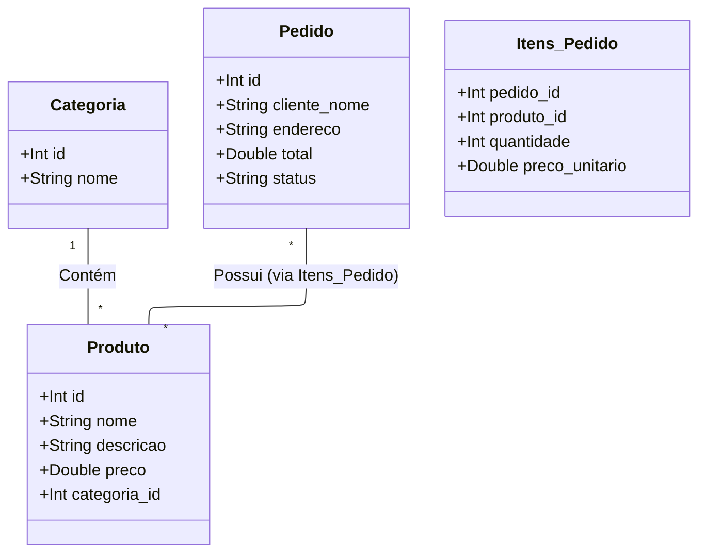

# Doce Cupcake — Back-end (Python / Flask / MVC)

Back-end completo da aplicação Doce Cupcake: cardápio, cadastro/login,
carrinho, pedidos e pagamento (simulado), além de melhorias de SEO e
marketing aplicadas a partir do material da disciplina.

## Padrão de projeto: MVC

| Camada         | Onde está                                   | Responsabilidade                                                                 |
|----------------|----------------------------------------------|-----------------------------------------------------------------------------------|
| **Model**      | `models/`                                    | Acesso ao banco SQLite e regras de negócio (senha, preço, pagamento, pedido).     |
| **View**       | `views/templates/` e `views/static/`         | HTML (Jinja2), CSS e JavaScript exibidos no navegador.                            |
| **Controller** | `controllers/`                               | Recebe as requisições HTTP, chama o Model certo e devolve a View (HTML ou JSON).  |

```
doce_cupcake_backend/
├── app.py                      # cria a aplicação Flask e registra os Controllers
├── config.py                   # configurações (banco, chave de sessão, WhatsApp)
├── requirements.txt
├── Procfile                    # comando de start para Render/Railway
├── DEPLOY.md                   # guia real de hospedagem (por que não Netlify)
├── database/
│   └── schema.sql              # estrutura das tabelas (produtos, usuários, pedidos, pagamentos...)
├── models/                     # -------- MODEL --------
│   ├── database.py             # conexão SQLite + criação/seed do banco
│   ├── category_model.py       # consultas de categorias
│   ├── product_model.py        # consultas de produtos e cálculo de preço
│   ├── order_model.py          # criação e consulta de pedidos
│   ├── user_model.py           # cadastro/login (senha com hash, nunca em texto puro)
│   ├── payment_model.py        # processamento do pagamento (simulado) de um pedido
│   └── newsletter_model.py     # captação de e-mails (lead capture)
├── controllers/                # -------- CONTROLLER --------
│   ├── main_controller.py      # páginas (/, /login, /cadastro, /pagamento, robots.txt, sitemap.xml)
│   ├── auth_controller.py      # /api/auth/register, /login, /logout, /me
│   ├── product_controller.py   # /api/categories, /api/products
│   ├── order_controller.py     # /api/orders
│   ├── payment_controller.py   # /api/orders/<id>/pagamento
│   └── newsletter_controller.py# /api/newsletter
└── views/                      # -------- VIEW --------
    ├── templates/
    │   ├── index.html
    │   ├── login.html
    │   ├── cadastro.html
    │   ├── pagamento.html
    │   └── partials/seo_head.html
    └── static/
        ├── css/ (style.css, auth.css, payment.css)
        └── js/ (main.js, auth.js, payment.js)
```

## Fluxo de uma compra

1. O cliente monta o carrinho na página inicial (o carrinho fica salvo
   no `localStorage` do navegador, só como conveniência de navegação
   entre páginas — nenhum preço é confiado a partir daí).
2. Ao clicar em "Finalizar pedido", vai para `/entrega`.
3. Se não estiver logado, é redirecionado para `/login` (e volta para
   a etapa certa depois de entrar).
4. Em `/entrega`, o cliente escolhe um endereço já salvo ou cadastra um
   novo (`POST /api/addresses`), e informa/confirma um telefone de
   contato para aquele pedido específico.
5. Só então vai para `/pagamento`, que cria o pedido
   (`POST /api/orders`) — nesse momento o **Model** recalcula o preço
   de cada item a partir do banco (ignorando qualquer valor vindo do
   navegador) e grava uma "fotografia" do endereço escolhido dentro do
   próprio pedido (assim, se o endereço salvo for editado ou apagado
   depois, o pedido antigo continua correto).
6. Em seguida processa o pagamento (`POST /api/orders/<id>/pagamento`)
   — simulado, mas com validações reais de formato (número de cartão,
   validade, CVV) e sem nunca gravar o número completo do cartão.
7. O pedido muda de status `pendente` para `pago`.

## Cadastro e login

Senhas nunca são gravadas em texto puro — usamos
`werkzeug.security.generate_password_hash` (biblioteca que já vem com
o Flask). A sessão do usuário logado é controlada pelo cookie de
sessão nativo do Flask (`SECRET_KEY` em `config.py`).

O cadastro agora também pede **telefone** (obrigatório) e, opcionalmente,
já permite cadastrar o primeiro **endereço** de entrega na mesma tela
(o cliente também pode pular essa parte e cadastrar o endereço depois,
na etapa de entrega do checkout). Cada usuário pode ter vários
endereços salvos (`models/address_model.py`) — o primeiro cadastrado
vira o padrão automaticamente.

## CEP automático (ViaCEP / base dos Correios)

Nos formulários de endereço (cadastro e etapa de entrega), ao digitar
o CEP e sair do campo, o front-end chama `GET /api/cep/<cep>`
(`controllers/cep_controller.py` → `models/cep_lookup.py`), que
consulta o [ViaCEP](https://viacep.com.br) — serviço público que usa
a base de dados dos Correios — e devolve rua, bairro, cidade e UF já
prontos para preencher o formulário. Erros de rede ou CEP inexistente
viram uma mensagem amigável, sem travar o formulário (a pessoa sempre
pode preencher manualmente).

## Pagamento

O pagamento continua sendo **simulado** (não há gateway ou banco real
por trás), mas com validações e cálculos de verdade:

- **Cartão** (`models/card_service.py`): o número passa pelo
  **algoritmo de Luhn** (o mesmo checksum que bandeiras reais usam
  para pegar erro de digitação) e a **bandeira** é identificada pelo
  prefixo (Visa, Mastercard, Amex, Elo). Parcelamento em até 12x, com
  **juros simples de 1,99% ao mês a partir da 4ª parcela** — igual à
  maioria dos e-commerces brasileiros. O CVV exigido tem 4 dígitos
  para Amex e 3 para as demais bandeiras.
- **Cartões salvos** (`models/card_model.py`): o cliente pode salvar
  um cartão para a próxima compra — só ficam guardados os 4 últimos
  dígitos, a bandeira, o nome e a validade; o número completo e o CVV
  nunca são persistidos. Numa compra seguinte, basta escolher o
  cartão salvo e digitar o CVV de novo para confirmar.
- **Pix** (`models/pix_service.py`): gera um código "Copia e Cola" no
  formato **EMV oficial do Banco Central** (com checksum CRC16
  válido), usando uma chave Pix fictícia.
- **Boleto** (`models/boleto_service.py`): gera uma linha digitável de
  **47 dígitos com os mesmos dígitos verificadores** (módulo 10 e
  módulo 11) de um boleto real, com vencimento em 3 dias — sem
  registro em banco nenhum por trás.

## Segurança

Medidas aplicadas contra vazamento/acesso indevido aos dados de cadastro,
endereço, cartão e telefone:

- **`DEBUG` nunca fica `True` por padrão** (`config.py`): o modo debug do
  Flask expõe um console Python interativo publicamente quando algo dá
  erro — isso permitiria a qualquer visitante executar código no
  servidor. Só liga com `FLASK_DEBUG=1` explícito, e nunca em produção
  (detecta o ambiente do Render automaticamente).
- **Criptografia em repouso** (`models/crypto_utils.py`, Fernet/AES):
  telefone e endereço (rua, número, complemento, bairro, CEP) — tanto
  do cadastro do usuário quanto do "retrato" gravado em cada pedido —
  ficam ilegíveis mesmo que alguém copie o arquivo do banco sem
  autorização. A chave vem de `APP_ENCRYPTION_KEY` (variável de
  ambiente); sem ela, a aplicação ainda funciona em desenvolvimento,
  mas usando uma chave derivada da `SECRET_KEY`.
- **Cartão nunca é gravado por completo**: nem o número nem o CVV —
  só os 4 últimos dígitos e a bandeira (ver seção Pagamento acima).
- **Rate limiting** (Flask-Limiter): login limitado a 8 tentativas por
  minuto por IP, cadastro a 10 por hora — dificulta força bruta e
  credential stuffing.
- **Sessão de login**: cookie `HttpOnly` (JavaScript não consegue ler),
  `SameSite=Lax` (mitiga CSRF), `Secure` em produção (só trafega por
  HTTPS), expira em 8h de inatividade.
- **Senha**: mínimo 8 caracteres, com letra e número.
- **Mensagens de erro genéricas no login** ("e-mail ou senha
  incorretos"), para não revelar se um e-mail existe na base.
- **Checagem de propriedade em todas as consultas sensíveis**: pedidos,
  endereços e cartões só podem ser lidos/alterados pelo próprio dono
  (comparação por `user_id` da sessão em todo Model/Controller).
- **Escape de HTML no front-end** (`security.js`): qualquer dado que o
  próprio usuário digitou (nome do endereço, nome no cartão) passa por
  escape antes de entrar na tela, evitando XSS armazenado.
- **Cabeçalhos HTTP de segurança** (`app.py`, recomendação OWASP):
  `Content-Security-Policy`, `X-Frame-Options: DENY`,
  `X-Content-Type-Options: nosniff`, `Referrer-Policy`,
  `Permissions-Policy`, e `Strict-Transport-Security` em produção.

### Variáveis de ambiente de segurança (configure em produção)

| Variável             | Para quê serve                                              |
|----------------------|---------------------------------------------------------------|
| `SECRET_KEY`         | Assina o cookie de sessão. Gerada automaticamente pelo `render.yaml`. |
| `APP_ENCRYPTION_KEY` | Criptografa telefone/endereço no banco. Gerada automaticamente pelo `render.yaml`. |
| `FLASK_DEBUG`        | Deixe **sem definir** em produção. Só use `1` localmente, se precisar depurar. |

⚠️ Se você trocar `SECRET_KEY` ou `APP_ENCRYPTION_KEY` depois de já ter
dados salvos, as sessões ativas caem (login pedido de novo) e os
campos criptografados antigos aparecem como `[dado protegido
indisponível]` — é esperado, não é bug.

### Limitações conhecidas (para evoluir depois)

- O rate limiting usa armazenamento em memória — funciona bem para uma
  única instância (este projeto), mas reinicia a contagem se o serviço
  reiniciar, e não escala para múltiplas instâncias sem um Redis.
- Não há verificação de e-mail no cadastro (qualquer e-mail é aceito).
- Não há autenticação de dois fatores (2FA).
- O banco (SQLite) em si não é criptografado por completo — só os
  campos mais sensíveis, no nível da aplicação.

## Melhorias aplicadas a partir das apostilas da disciplina

**SEO** (guia de SEO): title e meta description únicos por página,
`<link rel="canonical">`, `robots.txt` e `sitemap.xml` reais, dados
estruturados (JSON-LD), páginas transacionais (`/login`, `/cadastro`,
`/pagamento`) marcadas como `noindex` por não serem conteúdo público.

**Marketing digital** (apostila de marketing): captação de e-mails com
cupom de desconto (newsletter), botão flutuante de WhatsApp Business,
prova social (depoimento e avaliações), faixa de vantagens (frete
grátis, entrega rápida, pagamento seguro).

**Web design** (Gestalt / hierarquia visual): seção "Como funciona"
em 3 passos, galeria estilo Instagram e mais elementos visuais para
deixar a página menos vazia, mantendo o agrupamento por proximidade e
semelhança de cor entre elementos relacionados.

## Testes automatizados

O projeto tem uma suíte de testes (pytest) cobrindo os fluxos
principais: páginas, cadastro/login, recuperação de senha, pedidos,
cupom de desconto, pagamento (cartão/Pix/boleto) e exclusão de conta.

```bash
pip install -r requirements-dev.txt
pytest -v
```

Um workflow do GitHub Actions (`.github/workflows/tests.yml`) roda
essa suíte automaticamente a cada `push` ou pull request — se alguma
alteração futura quebrar um fluxo, aparece ali antes de ir para
produção.

## Minha Conta, cupom de desconto e privacidade

- **`/minha-conta`**: histórico de pedidos, endereços e cartões
  salvos (com opção de remover cada um), e exclusão de conta.
- **Cupom de desconto real**: quem se cadastra na newsletter recebe um
  código de verdade (não é só uma promessa) para usar na página de
  pagamento; o desconto é aplicado e o cupom só é "gasto" quando o
  pagamento é confirmado — carrinho abandonado não queima o cupom.
- **`/esqueci-senha`** e **`/redefinir-senha`**: geram um link de
  redefinição com token único e validade de 1h. Como o projeto não
  tem servidor de e-mail configurado, o link aparece diretamente na
  tela (deixado bem explícito na interface) em vez de fingir que foi
  enviado — o mecanismo por trás (token aleatório, expiração, uso
  único) é o mesmo que um sistema real usaria.
- **`/privacidade`**: política de privacidade; o cadastro exige aceite
  explícito. A exclusão de conta remove endereços/cartões salvos e
  desvincula (sem apagar) os pedidos já feitos — mesmo princípio de
  uma nota fiscal, que precisa ser preservada.

## Como rodar localmente

```bash
python -m venv venv
source venv/bin/activate        # Windows: venv\Scripts\activate
pip install -r requirements.txt
python app.py
```

Acesse `http://127.0.0.1:5000`. Na primeira execução, o banco
`database/cupcake.db` é criado e populado automaticamente.

## Como hospedar de verdade

Veja `DEPLOY.md` — o Netlify **não é adequado** para esta aplicação
(Flask + SQLite exigem um servidor persistente, que o Netlify não
oferece). O guia traz o passo a passo para Render, PythonAnywhere ou
Railway.

## Endpoints da API

| Método | Rota                              | Descrição                                             |
|--------|-------------------------------------|--------------------------------------------------------|
| GET    | `/api/categories`                  | Lista as categorias do cardápio                        |
| GET    | `/api/products`                    | Lista produtos (`?category=slug` filtra por categoria) |
| GET    | `/api/products/featured`           | Produto em destaque (com tamanhos e preços)             |
| GET    | `/api/products/<id>`               | Um produto específico                                  |
| POST   | `/api/auth/register`               | Cria conta (nome, e-mail, senha, telefone, endereço opcional) |
| POST   | `/api/auth/login`                  | Login (e-mail, senha)                                   |
| POST   | `/api/auth/logout`                 | Encerra a sessão                                        |
| GET    | `/api/auth/me`                     | Usuário logado atual                                    |
| DELETE | `/api/auth/me`                     | Exclui a conta (LGPD)                                    |
| POST   | `/api/auth/forgot-password`        | Gera um link de redefinição de senha                     |
| POST   | `/api/auth/reset-password`         | Define uma nova senha a partir do token                  |
| GET    | `/api/addresses`                   | Lista os endereços salvos do usuário logado             |
| POST   | `/api/addresses`                   | Cadastra um novo endereço                                |
| DELETE | `/api/addresses/<id>`              | Remove um endereço                                       |
| GET    | `/api/cep/<cep>`                   | Consulta CEP no ViaCEP (rua, bairro, cidade, UF)         |
| GET    | `/api/cards`                       | Lista os cartões salvos do usuário logado                |
| POST   | `/api/cards`                       | Salva um novo cartão (Luhn + bandeira validados)         |
| DELETE | `/api/cards/<id>`                  | Remove um cartão salvo                                    |
| GET    | `/api/coupons/<code>`              | Confere se um cupom é válido (sem marcar como usado)     |
| POST   | `/api/orders`                      | Cria um pedido (requer login, endereço e telefone)        |
| GET    | `/api/orders`                      | Histórico de pedidos do usuário logado ("Meus Pedidos")  |
| GET    | `/api/orders/<id>`                 | Consulta um pedido do usuário logado                     |
| POST   | `/api/orders/<id>/pagamento`       | Processa o pagamento (cartão, Pix ou boleto, simulado)   |
| POST   | `/api/newsletter`                  | Inscreve um e-mail e gera um cupom de boas-vindas         |

Exemplo de corpo para `POST /api/orders`:

```json
{
  "items": [
    { "product_id": 3, "size": "M", "quantity": 2 },
    { "product_id": 1, "size": null, "quantity": 1 }
  ],
  "address_id": 2,
  "contact_phone": "11912345678"
}
```

Exemplo de corpo para `POST /api/orders/<id>/pagamento` (cartão):

```json
{
  "method": "cartao",
  "card_name": "ANA BEATRIZ",
  "card_number": "4111111111111111",
  "expiry": "12/29",
  "cvv": "123"
}
```

Para Pix, basta `{"method": "pix"}`. Para boleto, `{"method": "boleto"}`.
Para pagar com cartão em parcelas: adicione `"installments": 6`. Para
usar um cartão salvo em vez de digitar o número de novo: envie
`"card_id": 3` no lugar de `card_number`/`card_name`/`expiry` (o CVV
continua sendo obrigatório).

desenhe os protótipos de tela (wireframes) 
<div align="center">

</div>

Diagrama UML


